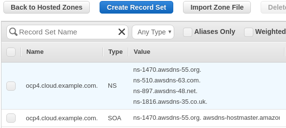

# OpenShift 4 Deploy

## Table of Contents

- [OpenShift 4 Deploy](#openshift-4-deploy)
  - [Table of Contents](#table-of-contents)
  - [Description](#description)
  - [Initial Setup](#initial-setup)
  - [Running The Automation](#running-the-automation)
    - [AWS](#aws)
      - [Create](#create)
      - [Destroy](#destroy)

## Description

Deploy OpenShift 4 on the following platforms:

- AWS

**IMPORTANT**

This project uses the **bare metal** method of installation on all platforms
listed above. This translates to there being **NO** integration with the underlying
infrastructure provider.

This means that OpenShift will not be able to:

- Autoscale using `MachineSets`
- Create load balancers automatically for your ingress routers
- Provision storage via the cloud provider plugin (e.g. EBS volumes)

If you would like a cluster that provides integration with the underlying
infrastructure provider, please see the built-in installation methods provided
with the OpenShift installer:
https://docs.openshift.com/container-platform/latest/welcome/index.html

## Initial Setup

**Step 1**

This project uses `pipenv` to create an isolated Python environment for running
the automation. If you do not already have `pipenv` installed on your system,
follow the instructions here:

https://pipenv.pypa.io/en/latest/install/#installing-pipenv

**Step 2**

Clone this repository.

```bash
git clone https://github.com/jaredhocutt/openshift4-deploy.git
```

**Step 3**

Create the `pipenv` environment and install the dependencies.

```bash
cd openshift4-deploy/

pipenv install
```

**Step 4**

Download and install Terraform.

```bash
./scripts/download_dependencies.sh
```

## Running The Automation

### AWS

#### Create

**Step 1**

Change your current directory to the cloned repository.

```bash
cd openshift4-deploy/
```

Activate the `pipenv` environment.

```bash
pipenv shell
```

**Step 2**

Export your AWS credentials and the region to use.

If you already have a profile setup using the
`awscli`, you can export `AWS_PROFILE`.

```bash
export AWS_PROFILE=default
export AWS_REGION=us-east-1
```

Otherwise, export `AWS_ACCESS_KEY_ID`
and `AWS_SECRET_ACCESS_KEY`.

```bash
export AWS_ACCESS_KEY_ID=access_key
export AWS_SECRET_ACCESS_KEY=secret=key
export AWS_REGION=us-east-1
```

**Step 3**

*If you already have an AWS key pair that you would like to use, you can skip
this step.*

If you do not have an AWS key pair or would like to create one specific to this
environment, log into the AWS console and create one in the region where you
will be deploying OpenShift 4.

Be sure to remember the **name** of the key pair and the **path** where you
saved the private key file as you will need them in the next step.

**Step 4**

There are several variables that you will need to define before running the
deployment that are specific to your environment.

| Variable            | Required           | Default | Description                                                                                                                                                                                                                                                                                                                                                                                                                                                                                                                                                                             |
| ------------------- | ------------------ | ------- | --------------------------------------------------------------------------------------------------------------------------------------------------------------------------------------------------------------------------------------------------------------------------------------------------------------------------------------------------------------------------------------------------------------------------------------------------------------------------------------------------------------------------------------------------------------------------------------- |
| `base_domain`       | :heavy_check_mark: |         | The base domain of the cluster.<br><br>All DNS will be sub-domains of this `base_domain` and include the `cluster_name`.                                                                                                                                                                                                                                                                                                                                                                                                                                                                |
| `cloud`             | :heavy_check_mark: |         | The cloud provider to deploy to.<br><br>You should set this to `aws` to deploy to AWS.                                                                                                                                                                                                                                                                                                                                                                                                                                                                                                  |
| `cluster_name`      | :heavy_check_mark: |         | The cluster name.<br><br>This value will be in your DNS entries and should conform to valid DNS characters.                                                                                                                                                                                                                                                                                                                                                                                                                                                                             |
| `keypair_name`      | :heavy_check_mark: |         | The name of the AWS key pair to use for the bastion host.                                                                                                                                                                                                                                                                                                                                                                                                                                                                                                                               |
| `keypair_path`      | :heavy_check_mark: |         | The path to the private key for your AWS key pair.<br><br>Note: The private key's integrity will be maintained. It is only used by Ansible to connect to the bastion host.                                                                                                                                                                                                                                                                                                                                                                                                              |
| `openshift_version` | :heavy_check_mark: |         | The OpenShift version to install.<br><br>The version must include the z-stream (e.g. 4.3.18)                                                                                                                                                                                                                                                                                                                                                                                                                                                                                            |
| `pull_secret`       | :heavy_check_mark: |         | The content of your pull secret, which can be found [here][pull_secret]. Be sure to wrap its value in single quotes.                                                                                                                                                                                                                                                                                                                                                                                                                                                                    |
| `rhcos_ami`         | :heavy_check_mark: |         | The AMI ID for RHCOS.<br><br>If you are deploying into a commercial AWS region, the AMI ID can be found [here][rhcos_ami_ids]. Be sure to the documentation you are looking at matches the version of OpenShift you are deploying to get the correct AMI IDs.<br><br>If you are deploying in AWS GovCloud, you will need to upload the RHCOS image and create your own AMI. After doing so, you can use that AMI ID for this variable.<br><br>The intention is to add support to have this variable default to a sensible value, but at the moment you will need to provide the AMI ID. |

[pull_secret]: https://cloud.redhat.com/openshift/install/pull-secret
[rhcos_ami_ids]: https://docs.openshift.com/container-platform/latest/installing/installing_aws/installing-aws-user-infra.html#installation-aws-user-infra-rhcos-ami_installing-aws-user-infra

Create a variable file at `<openshift4-deploy>/vars/ocp4.yml`.

```yaml
---

cloud: aws

openshift_version: 4.3.18

cluster_name: ocp4
base_domain: example.com

rhcos_ami: ami-123456789
keypair_name: mykeypair
keypair_path: ~/.ssh/mykeypair.pem

pull_secret: ''
```

**Step 5**

Log into the AWS console and create a public Route53 hosted zone for your
cluster.

The name **MUST** match the format `{{ cluster_name }}.{{ base_domain }}` using
the values you specified for those in your variable file.

For example, if `cluster_name` is `ocp4` and `base_domain` is
`cloud.example.com`, then your hosted zone should be `ocp4.cloud.example.com`.

After you create your hosted zone, you should see something similar to:



Copy the value for the `NS` record to your clipboard.

Go to your primary Route53 hosted zone for your domain (or subdomain), click **Create
Record Set** and add an `NS` record pointing to your new hosted zone.


After clicking **Create**, your primary Route53 hosted zone should look similar
to:


**Step 6**

Execute the automation while passing in your variable file.

```bash
ansible-playbook -e @vars/ocp4.yml playbooks/create_cluster.yml -v
```

**Step 7**

Execute the automation while passing in your variable file.

```bash
ansible-playbook -e @vars/ocp4.yml playbooks/create_cluster.yml -v
```

#### Destroy

Once you no longer need your cluster, execute the automation to destroy the
cluster while passing in the variable file you used when creating the cluster.

Be sure to execute the automation from the same machine and directory where you
created the clsuter as there is state data that is required to clean up all of
the resources.

```bash
ansible-playbook -e @vars/ocp4.yml playbooks/destroy_cluster.yml -v
```
