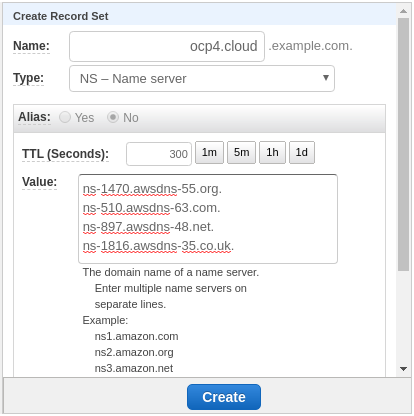
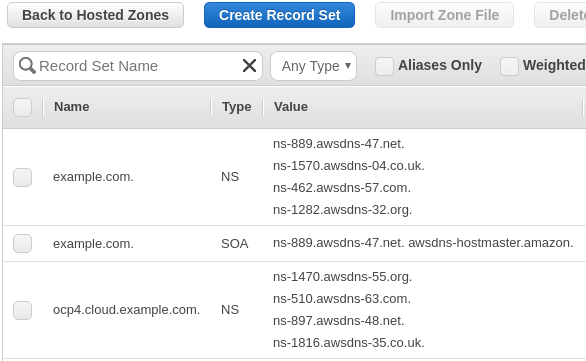

# Amazon Web Services (Generic Installation)

## Initial Setup

**Step 1**

This project provides a container image that includes all of the dependencies
required to run the automation. To run the container image, you will need
either `podman` or `docker` installed on your system.

To install `podman`, follow the instructions here:
https://podman.io/getting-started/installation.html

To install `docker`, follow the instructions here:
https://docs.docker.com/get-docker/

**Step 2**

Clone this repository.

```bash
git clone https://github.com/jaredhocutt/openshift4-deploy.git
```

**Step 3**

Change your current directory to the cloned repository.

```bash
cd openshift4-deploy/
```

> **NOTE:** The following sections of documentation will assume that you are in
> the root directory of the clone repository.

## Environment Variables

In order to follow the steps below, you need to export your AWS credentials and
the region to use.

If you already have a profile setup using the `awscli`, you can export
`AWS_PROFILE`. Your `~/.aws` directory will already be mounted to the
environment for you.

```bash
export AWS_PROFILE=default
export AWS_REGION=us-east-1
```

Otherwise, export `AWS_ACCESS_KEY_ID`
and `AWS_SECRET_ACCESS_KEY`.

```bash
export AWS_ACCESS_KEY_ID=access_key
export AWS_SECRET_ACCESS_KEY=secret-key
export AWS_REGION=us-east-1
```

## Create

**Step 1: Create/Identify the SSH keypair for the Bastion host**

*If you already have an AWS key pair that you would like to use, you can skip
this step.*

If you do not have an AWS key pair or would like to create one specific to this
environment, log into the AWS console and create one in the region where you
will be deploying OpenShift 4.

Be sure to remember the **name** of the key pair and the **path** where you
saved the private key file (this is the `.pem` file that you download when
creating your AWS key pair) as you will need them in the next step.

IMPORTANT: The key pair `.pem` file should be in `~/.ssh` as this directory
gets mounted to the environment for you. Also ensure that you set the
permissions to `0600` as you would for any SSH key.

**Step 2: Create your variable file**

There are several variables that you will need to define before running the
deployment that are specific to your environment.

| Variable                       | Required           | Default                                | Description                                                                                                                                                                                                                |
| ------------------------------ | ------------------ | -------------------------------------- | -------------------------------------------------------------------------------------------------------------------------------------------------------------------------------------------------------------------------- |
| `cloud`                        | :heavy_check_mark: |                                        | The cloud provider to deploy to.<br><br>You should set this to `aws`.                                                                                                                                                      |
| `openshift_version`            | :heavy_check_mark: |                                        | The OpenShift version to install.<br><br>The version must include the z-stream (e.g. 4.5.2).<br><br>The list of versions can be found [here][openshift_versions].                                                          |
| `cluster_name`                 | :heavy_check_mark: |                                        | The cluster name.<br><br>This value will be in your DNS entries and should conform to valid DNS characters.                                                                                                                |
| `base_domain`                  | :heavy_check_mark: |                                        | The base domain of the cluster.<br><br>All DNS will be sub-domains of this `base_domain` and include the `cluster_name`.                                                                                                   |
| `pull_secret`                  | :heavy_check_mark: |                                        | The content of your pull secret, which can be found [here][pull_secret]. Be sure to wrap its value in single quotes.                                                                                                       |
| `route53_hosted_zone_id`       |                    |                                        | The Route53 hosted zone ID to use for public DNS entries.<br><br>By default, it will be assumed that a public zone named `{{ cluster_name }}.{{ cluster_domain }}` exists. Define this variable to override this behavior. |
| `keypair_name`                 |                    | `{{ cluster_name }}-{{ base_domain }}` | The name of the AWS key pair to use for the bastion host.<br><br>An AWS key pair will be generated for you by default.                                                                                                     |
| `keypair_path`                 |                    | `~/.ssh/{{ keypair_name }}.pem`        | The path to the private key for your AWS key pair.<br><br>Note: The private key's integrity will be maintained. It is only used by Ansible to connect to the bastion host.                                                 |
| `fips_mode`                    |                    | `false`                                | Set to `true` to install a cluster that has FIPS-validation enabled.                                                                                                                                                       |
| `rhcos_ami`                    |                    |                                        | The AMI ID for RHCOS.<br><br>The AMI ID will be discovered for you by default, but if you'd like to use a specific AMI, it can be overriden using this variable.                                                           |
| `rhel_ami`                     |                    |                                        | The AMI ID for RHEL to use for the bastion.<br><br>The AMI ID will be discovered for you by default, but if you'd like to use a specific AMI, it can be overriden using this variable.                                     |
| `vpc_cidr`                     |                    | `172.31.0.0/16`                        | The CIDR to use when creating the VPC.                                                                                                                                                                                     |
| `vpc_subnet_bits`              |                    | `24`                                   | The number of bits to use when dividing VPC CIDR into subnets.                                                                                                                                                             |
| `instance_count_worker`        |                    | `3`                                    | The number of worker nodes to create initially.                                                                                                                                                                            |
| `ec2_instance_type_bastion`    |                    | `t3.medium`                            | The EC2 instance type for the bastion.                                                                                                                                                                                     |
| `ec2_instance_type_bootstrap`  |                    | `i3.large`                             | The EC2 instance type for the bootstrap node.                                                                                                                                                                              |
| `ec2_instance_type_controller` |                    | `m5.xlarge`                            | The EC2 instance type for the controller nodes.                                                                                                                                                                            |
| `ec2_instance_type_worker`     |                    | `m5.large`                             | The EC2 instance type for the worker nodes.                                                                                                                                                                                |
| `root_volume_size_bastion`     |                    | `100`                                  | The size of the root disk on the bastion.                                                                                                                                                                                  |
| `root_volume_size_bootstrap`   |                    | `120`                                  | The size of the root disk on the bootstrap node.                                                                                                                                                                           |
| `root_volume_size_controller`  |                    | `120`                                  | The size of the root disk on the controller nodes.                                                                                                                                                                         |
| `root_volume_size_worker`      |                    | `120`                                  | The size of the root disk on the worker nodes.                                                                                                                                                                             |
| `additional_authorized_keys`   |                    | `[]`                                   | A list of additional SSH public keys to add to the `~/.ssh/authorized_keys` on the bastion.                                                                                                                                |

[pull_secret]: https://cloud.redhat.com/openshift/install/pull-secret
[openshift_versions]: http://mirror.openshift.com/pub/openshift-v4/x86_64/clients/ocp/

Create a variable file at `vars/ocp4.yml`. An example file matching the content
below can be found at `vars/example.aws.yml`.

```yaml
---

# The cloud provider to deploy to.
cloud: aws

# The OpenShift version to install.
#
# The version must include the z-stream (e.g.4.4.3)
#
# The list of versions can be found at
# http://mirror.openshift.com/pub/openshift-v4/x86_64/clients/ocp/
openshift_version: 4.5.2

# The cluster name.
#
# This value will be in your DNS entries and should conform to valid DNS
# characters.
cluster_name: ocp4
# The base domain of the cluster.
#
# All DNS will be sub-domains of this base_domain and include the cluster_name.
base_domain: example.com

# The content of your pull secret, which can be found at
# https://cloud.redhat.com/openshift/install/pull-secret.
#
# Be sure to wrap its value in single quotes.
pull_secret: ''
```

**Step 3: Create your DNS records (Public Zone and NS record)**

> **NOTE:** If you have defined `route53_hosted_zone_id` in your variable file,
> you can skip this step.

Log into the AWS console and create a public Route53 Hosted Zone for your
cluster.

The name **MUST** match the format `{{ cluster_name }}.{{ base_domain }}` using
the values you specified for those in your variable file.

For example, if `cluster_name` is `ocp4` and `base_domain` is
`cloud.example.com`, then your hosted zone should be `ocp4.cloud.example.com`.

After you create your hosted zone, you should see something similar to:


Copy the value for the `NS` record to your clipboard.

Go to your primary Route53 hosted zone for your domain (or subdomain), click
**Create Record Set** and add an `NS` record pointing to your new hosted zone.



After clicking **Create**, your primary Route53 hosted zone should look similar
to:



**Step 4: Run the automation**

Execute the automation to **create** your cluster.

```bash
./openshift-deploy create --vars-file vars/ocp4.yml
```

## Start / Stop

If you are using this cluster for demonstration purposes, it's likely you'll
want to shut it down when you're not using it and be able to start it back up
when you need it.

> **IMPORTANT:** You cannot shutdown your cluster until after it has been up
> for at least 24 hours due to short-lived certificates that get rotated at the
> 24 hour mark. There is a known workaround documented [here][24_hour_stop] but
> has not been added to this deployment yet.

[24_hour_stop]: https://github.com/redhat-cop/openshift-lab-origin/blob/master/OpenShift4/Stopping_and_Resuming_OCP4_Clusters.adoc

Execute the automation to **start** your cluster.

```bash
./openshift-deploy start --vars-file vars/ocp4.yml
```

Execute the automation to **stop** your cluster.

```bash
./openshift-deploy stop --vars-file vars/ocp4.yml
```

## Destroy

Once you no longer need your cluster, you can use the automation to destroy
your cluster.

Execute the automation to **destroy** your cluster.


```bash
./openshift-deploy destroy --vars-file vars/ocp4.yml
```

## Cluster Information

When the automation to create a cluster completes, you were given output that
describes information about the cluster you just deployed. Sometimes it's
useful to get this information again.

> **NOTE:** Your cluster must be running for this to work. It requires
> connecting to your bastion host to pull important information about your
> cluster.

Execute the automation to display **information** about your cluster.

```bash
./openshift-deploy info --vars-file vars/ocp4.yml
```

## Shell

If you are trying to troubleshoot, make modifications to the automation, or
anything else that may require you to have access to an environment with all of
the software dependencies already available, you can open a shell into the
containerized environment.

Open a **shell** inside the containerized environment.

```bash
./openshift-deploy shell --vars-file vars/ocp4.yml
```
